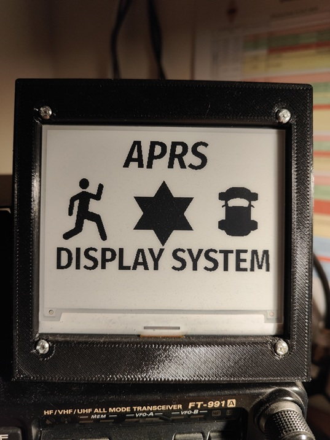

# APRS_Display_System

This is an advanced, multi-functional APRS (Automatic Packet Reporting System) frame display based on the ESP32 microcontroller. It is used to receive, decode, and display radio (or internet) frames on a low-power e-ink (WeAct 4,2'' BW) screen.

## Programming Description

## **Four Operating Modes (Data Interfaces):**

- VP-Digi UART (Hardware TNC): The program receives data directly via the physical RX/TX pins from an external modem (e.g., VP-Digi) using the KISS protocol.

* KISS TCP: The ESP32 connects via Wi-Fi as a client to an external KISS TCP server (e.g., DireWolf running on a Raspberry Pi). * APRS-IS: The ESP32 connects to the global APRS-IS network (e.g., poland.aprs2.net) via WiFi, authenticates with your username and password (passcode), and collects traffic from the surrounding area.
* Bluetooth SPP (HC-05 Client): The ESP32 uses its built-in Bluetooth module to wirelessly connect to an external modem equipped with an HC-05 module (e.g., a mobile tracker or radio).

## **Mechanisms:**
* BT Auto-Fallback (Failover Access Point): If the ESP32 fails to connect to the HC-05 module three times in a row in Bluetooth mode (e.g., radio off, power failure), the program automatically stops attempts, safely resets, and starts its own WiFi network (AP: APRS_DISPLAY_SETUP, IP: 192.168.4.1). This ensures you never lose access to the configuration panel in the event of a modem failure.

## **Data Decoding and Processing (Parser):**
* The program has a powerful internal decoder. It can parse the pure AX.25 protocol wrapped in KISS frames.

## **Supported Formats:**

* Standard position frames, compressed Mic-E format, Base91, weather (WX), and station information (PHG).

## **Radio Identification:**

* The system can recognize the radio model from which the packet was sent (e.g., Yaesu FTM-400, FTM-300, Kenwood TH-D74, APRSdroid app, etc.) based on the comment or destination callsign (TOCALL).

## **Navigational Mathematics:**

* The program continuously calculates the distance (in kilometers) and azimuth (direction, e.g., NW, SE) from your fixed location to the received object.

## **Screen Logic and Display (E-Ink 4.2"):**
* **Classic Mode:**
Displays a large icon of the last received station, an icon (e.g., car, stick figure, home station), a compass rose indicating the direction to the station, raw/decoded data, and the two previous stations in the history.
* **List Mode:**
A more compact layout that displays up to 6 recent stations one below the other, along with a shortened distance, direction, and radio model.
* **EMCOM:** Packets with the EMERGENCY flag bypass filters, activate a visual alarm at the bottom of the screen, trigger an immediate display refresh, and prevent the message from disappearing for one minute.

## **Filters and Additional Features:**
* **Anti-Duplicate:** The program ignores identical packets from the same station for 10 seconds (rejects retransmissions from Digipeaters).
* **Distance Filter:** Ability to reject stations located further than a specified distance.
* **Built-in Web Server:** A complete graphical interface accessible via a browser. It allows you to change all options, enter passwords, change the display mode, and includes a live view of the "Terminal," which receives raw data and device logs.
* **Beacon:** Option to automatically send your own position (frame) to the air (via UART/BT/TCP) or to the network (APRS-IS) at specified intervals.
* **Icons:** The device recognizes the most commonly used icons and displays them in the upper right corner of the screen.

## **Hardware Connection Diagram (Pinout)**
The E-Ink screen uses an SPI bus, while the TNC requires a hardware serial port (UART2). Below is a detailed table showing how to connect the cables between the modules and the ESP32 board (WROOM-32 / DevKit) and an E-Ink display (e.g., Waveshare / GxEPD2 4.2"). Note that the ESP32 has hardware pins assigned for SPI (SCK and MOSI), and the remaining control pins are defined manually in the code.
||||
|--|--|--|
**Pin on E-Ink module** | **Pin on ESP32** | **Description (Function)** |
|VCC (Power Supply) | 3.3V | Power supply for the display logic (Never 5V!)|
|GND (Ground) | GND | Common ground|
|DIN (MOSI) | GPIO 23 | Sending data from ESP to the display (Hardware SPI)|
|CLK (SCK) | GPIO 18 | Bus clock (Hardware SPI)|
|CS (Chip Select) | GPIO 5 | Defined in code as EPD_CS|
|DC (Data/Command) | GPIO 17 | Defined in code as EPD_DC|
|RST (Reset) | GPIO 16 | Defined in code as EPD_RST|
|BUSY (Busy) | GPIO 4 | Defined in code as EPD_BUSY|

(Note: The MISO pin is not needed, as the e-ink screen only receives drawing instructions.)

## Hardware Modem (VP-Digi / TNC) ↔ ESP32 (UART Mode)
The connection uses the hardware serial port on the ESP32. It requires a crossover connection (TX to RX).

||||
|--|--|--|
**Modem pin (e.g., VP-Digi)** | **ESP32 pin** |**Description (Function)**
TX (Transmit from TNC) | GPIO 26 | Defined as VP_RX_PIN (ESP32 receives data)
RX (Receive on TNC) | GPIO 27 | Defined as VP_TX_PIN (ESP32 sends beacon)
GND (Ground) | GND | Common ground between the chips is absolutely critical!

## **Bluetooth module (HC-05 connected to radio)**
* You connect the HC-05 to your mobile modem/radio via hardware using RX/TX cables (e.g., to the DATA port). * The ESP32 board communicates fully wirelessly with this HC-05 via Bluetooth and the MAC address entered in the web configuration panel.
* **Note: WiFi is disabled when using Bluetooth mode!**

Beta version, source code will be available soon!
