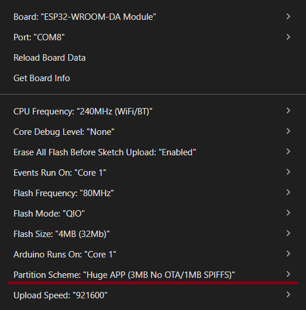

# APRS_Display_System

To zaawansowany, wielofunkcyjny wyświetlacz ramek APRS (Automatic Packet Reporting System) oparty na mikrokontrolerze ESP32, który służy do odbierania, dekodowania i wyświetlania ramek radiowych (lub internetowych) na energooszczędnym ekranie e-ink (WeAct 4,2" BW).

## Opis programowania
Pliki SP3WRO_APRS_DISPLAY.ino oraz icons.h powinny znajdować się razem w jednym folderze.
Uruchamiamy plik .ino w Arduino IDE. W narzędziach wybieramy opcję HUGE APP (3MB No OTA/1MB SPIFFS) tak jak na zdjęciu.
Następnie kompilujemy program i wgrywamy na urządzenie. Po chwili uruchomi się ekran powitalny.

## **Cztery tryby pracy (Złącza danych):**

- VP-Digi UART (Sprzętowy TNC): Program odbiera dane bezpośrednio przez fizyczne piny RX/TX z zewnętrznego modemu (np. VP-Digi) używając protokołu KISS.

* KISS TCP: ESP32 łączy się przez WiFi jako klient z zewnętrznym serwerem KISS TCP (np. z programem DireWolf działającym na Raspberry Pi).
* APRS-IS: ESP32 łączy się przez internet za pomocą WiFi z globalną siecią APRS-IS (np. poland.aprs2.net), autoryzuje się Twoim znakiem i hasłem (passcode) i pobiera ruch z okolicy.
* Bluetooth SPP (Klient HC-05): ESP32 wykorzystuje swój wbudowany moduł Bluetooth, aby bezprzewodowo połączyć się z zewnętrznym modemem wyposażonym w moduł HC-05 (np. z mobilnym trackerem czy radiem).

## **Mechanizmy:**
* BT Auto-Fallback (Awaryjny Punkt Dostępu): Jeśli ESP32 w trybie Bluetooth nie zdoła połączyć się z modułem HC-05 trzy razy z rzędu (np. wyłączone radio, awaria zasilania), program automatycznie wstrzymuje próby, resetuje się w bezpieczny sposób i uruchamia własną sieć WiFi (AP: APRS_DISPLAY_SETUP, IP: 192.168.4.1). Dzięki temu nigdy nie tracisz dostępu do panelu konfiguracyjnego w razie awarii modemu.

## **Dekodowanie i Przetwarzanie Danych (Parser):**
* Program posiada potężny wewnętrzny dekoder. Potrafi analizować czysty protokół AX.25 zawinięty w ramki KISS.
  
## **Obsługiwane formaty:** 

* Standardowe ramki pozycyjne, format skompresowany Mic-E, Base91, pogodowe (WX) oraz informacje o stacji (PHG).
  
## **Identyfikacja Radia:**
  
* System potrafi rozpoznać, z jakiego modelu radia został wysłany pakiet (np. Yaesu FTM-400, FTM-300, Kenwood TH-D74, aplikacja APRSdroid itp.) na podstawie komentarza lub znaków docelowych (TOCALL).

## **Matematyka nawigacyjna:**

* Program na bieżąco oblicza dystans (w kilometrach) oraz azymut (kierunek, np. NW, SE) z Twojej stałej lokalizacji do odebranego obiektu.

## **Logika Ekranu i Wyświetlanie (E-Ink 4.2"):**
* **Tryb Klasyczny:** 
Wyświetla duży znak ostatnio odebranej stacji, ikonę (np. samochód, ludzik, stacja domowa), różę wiatrów wskazującą kierunek do stacji, surowe/zdekodowane dane oraz dwie poprzednie stacje w historii.
* **Tryb Listy:** 
Bardziej kompaktowy układ wyświetlający do 6 ostatnich stacji jedna pod drugą, wraz ze skróconym dystansem, kierunkiem i modelem radia.
* **EMCOM:** Pakiety z flagą EMERGENCY omijają filtry, aktywują wizualny alarm na dole ekranu, wyzwalają natychmiastowe odświeżenie wyświetlacza i blokują zniknięcie komunikatu przez minutę.

## **Filtry i Funkcje Dodatkowe:** 
* **Anti-Duplicate:** Program ignoruje identyczne pakiety z tej samej stacji przez 10 sekund (odrzuca retransmisje z digipeaterów).
* **Filtr Dystansu:** Możliwość odrzucenia stacji znajdujących się dalej niż zadany limit kilometrów.
* **Wbudowany Serwer WWW:** Kompletny interfejs graficzny dostępny z poziomu przeglądarki. Umożliwia zmianę wszystkich opcji, wpisywanie haseł, zmianę trybu wyświetlania i zawiera podgląd na żywo tzw. "Terminala", na który spływają surowe dane i logi pracy urządzenia.
* **Beacon:** Opcja automatycznego wysyłania własnej pozycji (ramki) w eter (przez UART/BT/TCP) lub do sieci (APRS-IS) w określonym interwale czasu.
* **Ikony:** Urządzenie rozpoznaje większość najczęściej używanych ikon i wyświetla je w prawym górnym rogu ekranu.

## **Schemat połączeń sprzętowych (Pinout)**
Ekran E-Ink wykorzystuje magistralę SPI, natomiast TNC wymaga sprzętowego portu szeregowego (UART2). Poniżej znajduje się dokładna tabela, jak należy połączyć przewody między modułami a płytką ESP32 (WROOM-32 / DevKit) i wyświetlaczem E-Ink (np. Waveshare / GxEPD2 4.2") Zwróć uwagę na to, że układ ESP32 ma przypisane sprzętowe piny dla SPI (SCK i MOSI), a pozostałe piny sterujące zdefiniowane są ręcznie w kodzie.
||||
|--|--|--|
**Pin na module E-Ink** | **Pin na ESP32** | **Opis (Funkcja)** |
|VCC   | 3.3V         | Zasilanie układu logiki ekranu (Nigdy 5V!)|
|GND       | GND      | Wspólna masa|
|SDA  | GPIO 23       | Przesyłanie danych z ESP do ekranu (Hardware SPI)|
|SCL           | GPIO 18      | Zegar taktujący magistrali (Hardware SPI)|
|CS     | GPIO 5       | Zdefiniowany w kodzie jako EPD_CS|
|DC    | GPIO 17      | Zdefiniowany w kodzie jako EPD_DC|
|RST          | GPIO 16      | Zdefiniowany w kodzie jako EPD_RST|
|BUSY    | GPIO 4       | Zdefiniowany w kodzie jako EPD_BUSY|

## Sprzętowy Modem (VP-Digi / TNC) ↔ ESP32 (Tryb UART)
Połączenie wykorzystuje sprzętowy port Serial na ESP32. Wymaga połączenia na krzyż (TX do RX).
||||
|--|--|--|
**Pin z modemu (np. VP-Digi)**   |   **Pin na ESP32**    |**Opis (Funkcja)**
TX (Nadawanie z TNC)         |     GPIO 26  |   Zdefiniowany jako VP_RX_PIN (ESP32 odbiera dane)
RX (Odbieranie w TNC)        |     GPIO 27   |  Zdefiniowany jako VP_TX_PIN (ESP32 wysyła beacona)
GND (Masa)                   |       GND      | Wspólna masa między układami jest absolutnie krytyczna!

## **Moduł Bluetooth (HC-05 podłączony do radia)**
* HC-05 podłączasz sprzętowo za pomocą przewodów RX/TX do swojego modemu mobilnego/radia (np. do portu DATA).
* Płytka ESP32 komunikuje się z tym HC-05 w pełni bezprzewodowo z Bluetooth i adresu MAC wpisanego w panelu konfiguracyjnym WWW.
* **Uwaga! W trakcie używania trybu Bluetooth wyłączone jest WiFi!**

